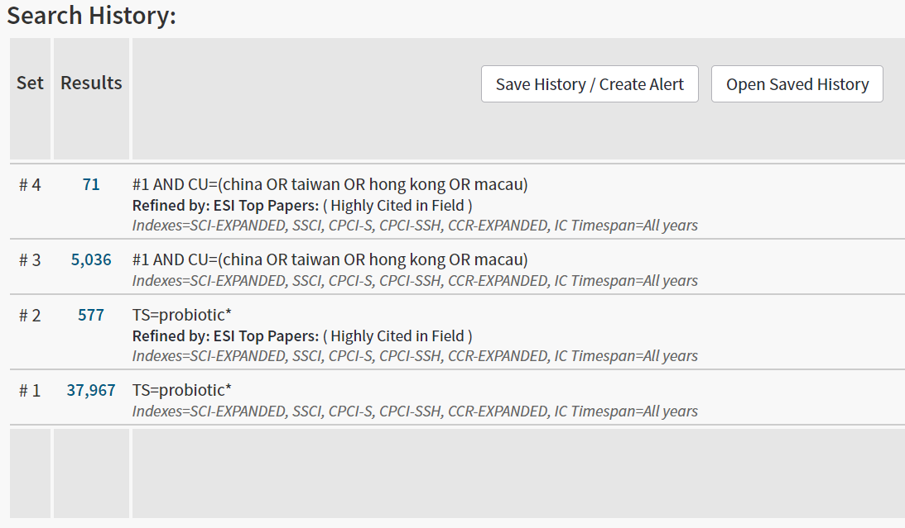
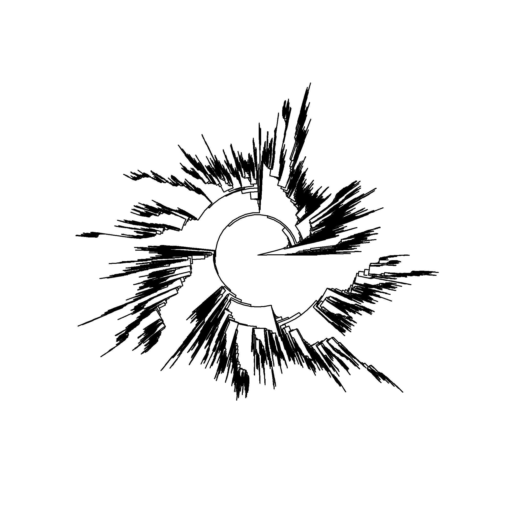

# 原始数据处理 {#raw-data}

```{r}
echo <- knitr::opts_chunk$get("echo")
if (!isTRUE(echo)) knitr::opts_chunk$set(echo = TRUE)
```


## 文献数据的预处理

在 WoS 数据库（Core Collection）中检索（2020-12-14）中检索 “probiotic(s)” ，
一共可以得到 37967 条结果，含 ESI 高被引论文 577 篇；
其中，由来源中国的科学家发表的文献数目为 5036 篇，含 ESI 高被引论文 71 篇（图 \@ref(fig:wos-search-result)，[^fn-wos-query]）。

```{r wos-search-result, fig.cap="在 WoS 数据库检索时的结果界面"}

```

[^fn-wos-query]: 由于在 WoS 数据库中，部分来自于台湾、香港等地的论文没有准确标识为中国（China），
所以在设定检索式时做了相应的考虑。

我们从 WoS 数据库下载了下列几个部分的数据：

- #1，即全部的益生菌相关研究文献的官方统计数据概要；
- #2，即全部与益生菌相关研究的高被引论文的完整内容；
- #3，即由中国人发表（含参与）的全部与益生菌相关研究的论文的完整内容；
- #4，即由中国人发表（含参与）的全部与益生菌相关研究的高被引论文的完整内容。

WoS 导出的数据主要由 `bibliometrix` 软件包处理。

```{r}
library(bibliometrix)
highly_cited_export <- "data-raw/probiotic-full-result-highly-cited-record-export.txt"
china_study_export <- "data-raw/probiotic-china-result-record-export.txt"

# in the latest version, convert2df() runs much faster than before
highly_cited <- convert2df(file = highly_cited_export,
                           dbsource = "wos",
                           format = "plaintext")
china_study <- convert2df(file = china_study_export,
                          dbsource = "wos",
                          format = "plaintext")

# there are a few record are duplicated in China result export file,
# we then remove them by UT matching (UT is unique for wos entry)
china_study <- duplicatedMatching(china_study, Field = "UT", exact = TRUE)
```


为每一篇论文加入耳熟能详的影响因子数据。

```{r}
library(dplyr)
file <- "data-raw/2019_Impact_factor.xlsx"
journal_IF <- openxlsx::read.xlsx(file,startRow=3)  %>%
  select(SO,impact_factor) %>%
  mutate(SO=toupper(SO),
         impact_factor=as.numeric(impact_factor)) %>%
  unique() %>%
  mutate(group=cut(impact_factor,
                   breaks = c(-Inf,3,5,10,20,Inf),
                   labels = c("<3",">3",">5",">10",">20")))

highly_cited <- highly_cited %>% left_join(journal_IF)
china_study <- china_study %>% left_join(journal_IF)
```

为了尽可能少的重名，我们使用完整的姓名来区分不同的作者。

```{r}
highly_cited$AU <- highly_cited$AF
china_study$AU <- china_study$AF
```

添加作者国家信息。

```{r}
highly_cited <- metaTagExtraction(highly_cited, Field = "AU_CO")
china_study <- metaTagExtraction(china_study, Field = "AU_CO")

uniq_tag <- function(M, Field = "AU_CO", sep = ";"){
  value <- M[[Field]]
  new_field_name <- paste0(Field, "_NR")
  new_field_value <- unlist(lapply(strsplit(value, split = sep), function(x){
    paste(unique(x), collapse = sep)
  }))
  M[[new_field_name]] <- new_field_value
  return(M)
}

highly_cited <- uniq_tag(highly_cited)
china_study <- uniq_tag(china_study)
```

整合作者单位信息。


```{r}
highly_cited <- uniq_tag(highly_cited, Field = "AU_UN")
china_study <- uniq_tag(china_study, Field = "AU_UN")

```

综上所述，文献数据的预处理包括对 WoS 数据的规范和添加一些辅助信息，
以便为后续的分析打好基础。
预处理后的数据保存下来，供后续使用时调用。

```{r}
saveRDS(highly_cited, file = "data/highly_cited.RDS")
saveRDS(china_study, file = "data/china_study.RDS")
```


## 物种信息的处理

常见的益生菌是各种乳酸菌，在微生物分类学上通常来源于两个属（genus）：
*Bifidobacterium* 和 *Lactobacillus*。但是，并非全部的益生菌都来源于这两个属。

为了尽可能的确定每一篇文献中描述的益生菌来源，我们需要构建一个微生物属名数据库。
经过调研，最终决定依托 ['The All-Species Living Tree' Project （LTP）](https://www.arb-silva.de/projects/living-tree/)来完成。

LTP 维护了现有已知的所有物种名称，因此我们可以从中提取出属名，
在此基础上根据属名的检索结果确定每一个益生菌研究中所用的益生菌的类型。

```{r}
library(ggtree)
library(treeio)

# there is a bug in read.tree, see https://github.com/YuLab-SMU/treeio/pull/41
# 'The All-Species Living Tree' Project 
file_SSU = "data-raw/LTPs132_SSU_tree.newick"
tree_data <- scan(file = file_SSU, 
                  what = "", 
                  sep = "\n", 
                  quiet = TRUE, 
                  encoding = "UTF-8")
tree_data <- gsub(" ","_",tree_data)
tree_data <- paste0(tree_data, collapse = "")
ltp_SSU <- read.tree(text = tree_data)

SSU_file <- "data-raw/LTPs123_LSU_tree.newick"
ltp_LSU <- read.tree(file = SSU_file, skip =  11)
```


```{r eval=FALSE, include=FALSE}
p <- ggtree(ltp, layout = "circular") 
ggsave("figure/ltp-tree.png", plot = p, scale = 2)
```

图 \@ref(fig:ltp-tree) 可以一瞥所有这些物种。不过我们关心的是属名。

```{r ltp-tree, fig.cap="全部物种的进化树"}

```

所以，我们从 `tip.label` 中提取物种的信息，并保存到 `organism.Rds` 中。

```{r}
library(tidyr)

prokaryotic_organism <- tibble(ltp = ltp_SSU$tip.label) %>%
  separate(col = ltp, 
           into = c("accession","genus_species","family"),
           sep = "__",
           extra = "drop") %>%
  separate(col = genus_species,
           into = c("genus","species"),
           sep = "_",
           extra = "drop")  # extra is subsp. info
eukaryotic_organism <- tibble(ltp = ltp_LSU$tip.label) %>%
  separate(col = ltp, 
           into = c("genus_species","accession","family"),
           sep = "__",
           extra = "drop") %>%
  separate(col = genus_species,
           into = c("genus","species"),
           sep = "_",
           extra = "drop")  # extra is subsp. info
organism <- rbind(prokaryotic_organism, eukaryotic_organism)
saveRDS(organism, file = "data/organism.Rds")
```

这些物种共有 `r nrow(organism)` 个，
来自于 `r length(unique(organism$genus))` 个不同的属，
`r length(unique(organism$family))` 个不同的科。

```{r include=FALSE}
knitr::opts_chunk$set(echo = echo)
```