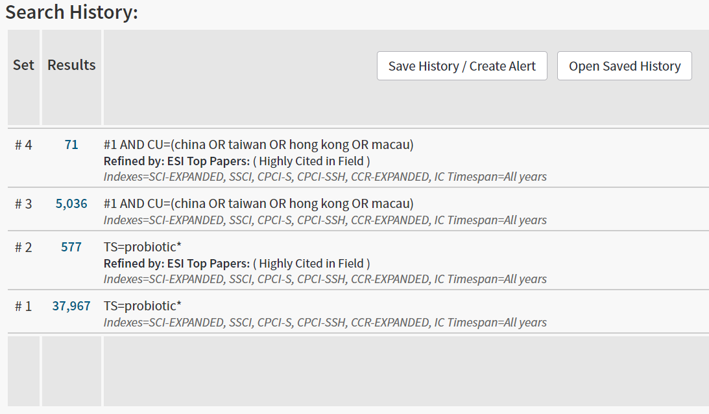

# 原始数据处理 {raw-data}

## 文献数据的预处理

在 WoS 数据库（Core Collection）中检索（2020-12-14）中检索 “probiotic(s)” ，
一共可以得到 37967 条结果，含 ESI 高被引论文 577 篇；
其中，由来源中国的科学家发表的文献数目为 5036 篇，含 ESI 高被引论文 71 篇（图 \@ref(fig:wos-search-result)，[^fn-wos-query]）。

```{r wos-search-result, fig.cap="在 WoS 数据库检索时的结果界面"}

```

[^fn-wos-query]: 由于在 WoS 数据库中，部分来自于台湾、香港等地的论文没有准确标识为中国（China），
所以在设定检索式时做了相应的考虑。

我们从 WoS 数据库下载了下列几个部分的数据：

- #1，即全部的益生菌相关研究文献的官方统计数据概要；
- #2，即全部与益生菌相关研究的高被引论文的完整内容；
- #3，即由中国人发表（含参与）的全部与益生菌相关研究的论文的完整内容；
- #4，即由中国人发表（含参与）的全部与益生菌相关研究的高被引论文的完整内容。

WoS 导出的数据主要由 `bibliometrix` 软件包处理。

```{r}
library(bibliometrix)
highly_cited_export <- "data-raw/probiotic-full-result-highly-cited-record-export.txt"
china_study_export <- "data-raw/probiotic-china-result-record-export.txt"

# in the latest version, convert2df() runs much faster than before
highly_cited <- convert2df(file = highly_cited_export,
                           dbsource = "wos",
                           format = "plaintext")
china_study <- convert2df(file = china_study_export,
                          dbsource = "wos",
                          format = "plaintext")

# there are a few record are duplicated in China result export file,
# we then remove them by UT matching (UT is unique for wos entry)
china_study <- duplicatedMatching(china_study, Field = "UT", exact = TRUE)
```


为每一篇论文加入耳熟能详的影响因子数据。

```{r}
library(dplyr)
file <- "data-raw/2019_Impact_factor.xlsx"
journal_IF <- openxlsx::read.xlsx(file,startRow=3)  %>%
  select(SO,impact_factor) %>%
  mutate(SO=toupper(SO),
         impact_factor=as.numeric(impact_factor)) %>%
  unique() %>%
  mutate(group=cut(impact_factor,
                   breaks = c(-Inf,3,5,10,20,Inf),
                   labels = c("<3",">3",">5",">10",">20")))

highly_cited <- highly_cited %>% left_join(journal_IF)
china_study <- china_study %>% left_join(journal_IF)
```

为了尽可能少的重名，我们使用完整的姓名来区分不同的作者。

```{r}
highly_cited$AU <- highly_cited$AF
china_study$AU <- china_study$AF
```

添加作者国家信息。

```{r}
highly_cited <- metaTagExtraction(highly_cited, Field = "AU_CO")
china_study <- metaTagExtraction(china_study, Field = "AU_CO")

uniq_tag <- function(M, Field = "AU_CO", sep = ";"){
  value <- M[[Field]]
  new_field_name <- paste0(Field, "_NR")
  new_field_value <- unlist(lapply(strsplit(value, split = sep), function(x){
    paste(unique(x), collapse = sep)
  }))
  M[[new_field_name]] <- new_field_value
  return(M)
}

highly_cited <- uniq_tag(highly_cited)
china_study <- uniq_tag(china_study)
```

综上所述，文献数据的预处理包括对 WoS 数据的规范和添加一些辅助信息，
以便为后续的分析打好基础。
预处理后的数据保存下来，供后续使用时调用。

```{r}
saveRDS(highly_cited, file = "data/highly_cited.RDS")
saveRDS(china_study, file = "data/china_study.RDS")
```


## 物种信息的处理

常见的益生菌是各种乳酸菌，在微生物分类学上通常来源于两个属（genus）：

